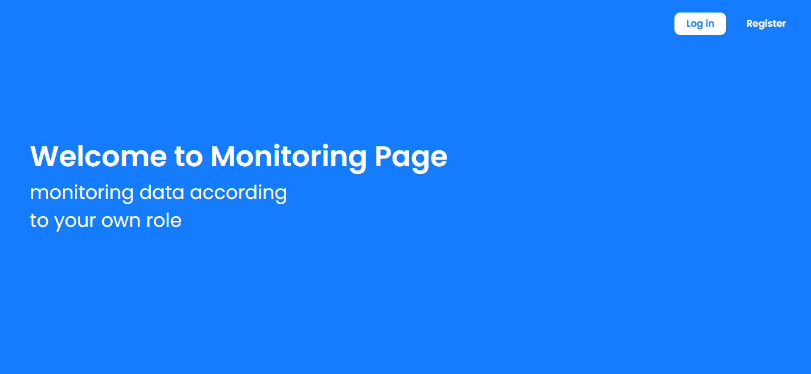
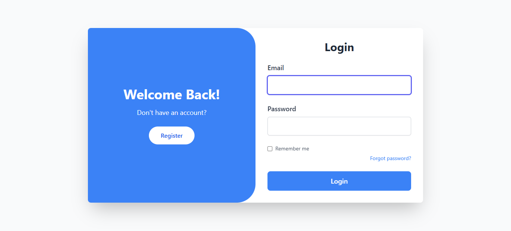
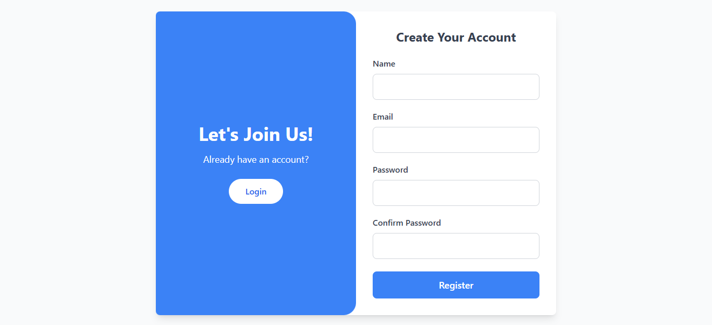
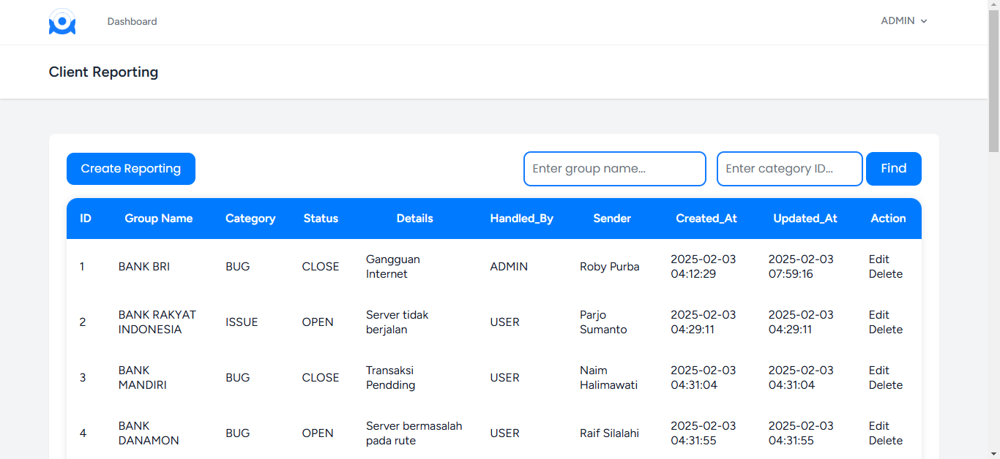
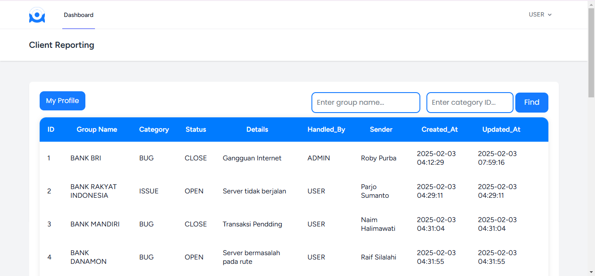

# Ujikom Laravel Project

## Pendahuluan
Ini adalah project ujikom berbasis Laravel yang mencakup berbagai fitur seperti sistem login, manajemen peran, sistem tiket, dan lainnya.

## Fitur Utama
- Sistem login dan UI untuk Admin serta User.
- Manajemen peran akses.
- Sistem tiket dengan fitur Read, Update, dan Delete tiket.
- Menu profil ( Biodata, unggah Foto, ubah Foto, ubah Kata Sandi).
- Logout.
- Fitur pencarian data berdasarkan Group Name.

## Persyaratan
- PHP >= 8.1
- Composer
- Node.js & NPM
- MySQL

## Instalasi

-----------------------------------------------------------------------------------------------------------------------

1. Clone repositori yang ada di bawah ( Menggunakan Git Bash ):
   
   git clone https://github.com/mtzyexqiu/ujikomlaravelz.git
   cd ujikom-laravel-project

-----------------------------------------------------------------------------------------------------------------------

2. Install dependencies dengan Composer dan NPM:

   composer install
   npm install && npm run dev

-----------------------------------------------------------------------------------------------------------------------   
3. Salin file konfigurasi `.env`:

   cp .env.example .env

-----------------------------------------------------------------------------------------------------------------------   
4. Atur konfigurasi database di file `.env`:

   DB_DATABASE=ujikomlaravelz
   DB_USERNAME=root
   DB_PASSWORD=

-----------------------------------------------------------------------------------------------------------------------

5. Generate application key:

   php artisan key:generate

-----------------------------------------------------------------------------------------------------------------------

6. Jalankan migrasi dan seeder ( Menggunakan Git bash ):

   php artisan migrate --seed

-----------------------------------------------------------------------------------------------------------------------

7. Jalankan Command :

   php artisan serve

-----------------------------------------------------------------------------------------------------------------------

8. Lalu akses aplikasi di : `http://localhost:8000`.

-----------------------------------------------------------------------------------------------------------------------
 
 # UI Home Page

 

 # UI Login Page

 

# UI Register Page

 

 # UI Dashboard Admin Page

 
 

  # UI Dashboard Admin User

 

